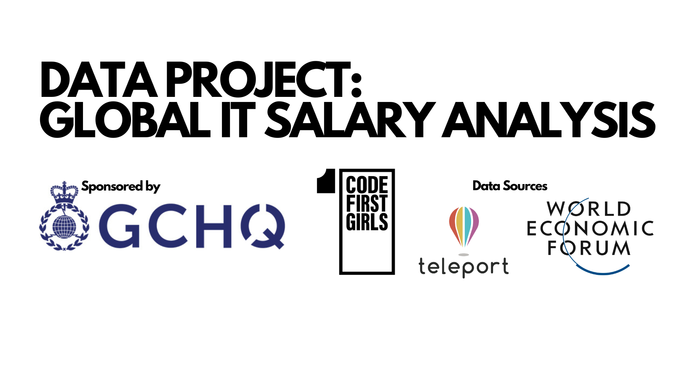

# GLOBAL IT SALARY ANALYSIS

## GIVE A BRIEF DESCRIPTION OF THIS PROJECT 

This project provides an in-depth analysis of worldwide IT job salaries, with a particular focus on gender-based wage disparities. Beyond mere financial aspects, our exploration of IT compensation delves deeper, our project is designed to conduct a thorough examination of global IT job salaries, encompassing a multifaceted approach. We aim to uncover variations in compensation across different countries, specifically addressing the gender wage gap within the IT sector. Additionally, we seek to understand the influence of population density on salary values by employing a simple linear regression model. This multifaceted exploration will provide valuable insights into the complex dynamics of IT job compensations worldwide.

As this project marks the culmination of our Code First Girls data analysis degree, our aim was to challenge ourselves by applying the extensive knowledge gained throughout the course. For the execution of this project, we utilized Python and Jupyter Notebook, leveraging various libraries including Pandas, Seaborn, Matplotlib, as well as employing diverse machine learning models. Additionally, we incorporated skills in API data retrieval and integrated SQL for enhanced functionality and analysis.

## The GitGirls Collective - Group 7 
__________________________________________________________________________________________________________________________

- Sam Kerr 
- Nicola Prevost 
- Tatiana Ngamba 
- Alicia Monge Grasa
- Samatha Hughes-Stanley

This readme file outlines the instructions of how to run the project code

#
#
# 🔧 Prerequisites 🔧
___________________________________________________________________________________________________________________________
For the correct functioning of the project, before running any of the project code files, **the user must need to have installed in their PC MySQL Workbench, Python and Jupyter**. 

## Required Python Libraries and version compatibility:
Make sure the following python libraries are installed. See the versions used for each of these libraries that allowed us to code and run this code effectively - to avoid certain errors we experienced we want to emphasize the importance of having pandas library updated:

**Library == version**

● pandas == 2.1.4

● numpy == 1.26.2

● seaborn == 0.13.0

● matplotlib == 3.8.2

● SQLAlchemy == 2.0.23

● mysql-connector-python == 8.2.0

● scikit-learn == 1.3.1

● statsmodel == 0.14.0

● geopandas == 0.14.0

Run the code <!pip install library_name> in your Jupyter Notebook to install each of the above modules. If you are executing these commands directly in the terminal, exclude the leading "!":

!pip install pandas

!pip install numpy

!pip install seaborn

!pip install matplotlib

!pip install SQLAlchemy

!pip install mysql-connector-python

!pip install statsmodels

!pip install scikit-learn

!pip install sqlalchemy

!pip install geopandas

# 📂 Data files and datasets 📂

## Jupyter Notebooks and Python files
___________________________________________________________________________________________________________________________
 - Download both notebooks [GLOBAL IT SALARY ANALYSIS - Notebook Part 1 (Python API code)](https://github.com/Tatiana-Ngamba/The-GitGirls-Collective-group-7/blob/Project_Code/GLOBAL%20IT%20SALARY%20ANALYSIS%20-%20Notebook%20Part%201%20(Python%20API%20code).ipynb) and [GLOBAL IT SALARY ANALYSIS - Notebook Part 2 (Data Analysis)](https://github.com/Tatiana-Ngamba/The-GitGirls-Collective-group-7/blob/Project_Code/GLOBAL%20IT%20SALARY%20ANALYSIS%20-%20Notebook%20Part%202%20(Data%20Analysis).ipynb) which also can be found in the branch *Project Code* [here](https://github.com/Tatiana-Ngamba/The-GitGirls-Collective-group-7/tree/Project_Code)
 - Download the folder called ‘data’ and its contents (see Datasets section below)
 - Download the [config.py](https://github.com/Tatiana-Ngamba/The-GitGirls-Collective-group-7/blob/Project_Code/config.py) python file from the same branch and [.gitignore](https://github.com/Tatiana-Ngamba/The-GitGirls-Collective-group-7/blob/Project_Code/.gitignore)
 - Select Python3 kernel for Jupyter notebook initialisation
 - Use the command - jupyter lab - in the python terminal to initialise it
 - Place both Jupyter Notebooks and the python file in the same path as the jupyter session just initialised

## Datasets 
___________________________________________________________________________________________________________________________
Part of the data gets retrieved via an API call but this project makes use of additional data sources as csv and SQL files too.
In the same path where the Notebooks and py files have been previously saved, create a folder named *data* and download and place there the following datasets and files which can be downloaded from [here](https://github.com/Tatiana-Ngamba/The-GitGirls-Collective-group-7/tree/Project_Code/data): 
- gender_pay_gap.csv
- job_insights.xlsx
- cost_living_w_codes.csv
- output_gbp_salaries_23-11-29_10-55.csv *Note that this file is generated after running the API call from the Jupyter Notebook Part 1 so it is optional to download it from GitHub. If it is decided to be used, the user can skip the step of calling the API running the notebook part 1 and no changes are required. If, instead, it gets downloaded after running the Jupyter Notebook Part 1, a new file gets generated and the file name will differ therefore make sure to change the file name in Jupyter Notebook part 2. Instructions for this are mentioned also directly in the Jupyter Notebook part 2*

- In the same GitHub folder the following SQL file is required to run the project [country_codes.sql](https://github.com/Tatiana-Ngamba/The-GitGirls-Collective-group-7/blob/Project_Code/data/country_codes.sql) which needs to be run in MySQL Workbench

# ✨ Ready to run ✨

Once all the above steps have been followed, before running the notebooks, make sure to do the following steps one by one:

- In the config.py file write your password to MySQL Workbench as follows: DATABASE_PASSWORD = 'Insert_your_password'. DATABASE_USER and DATABASE_HOST are usually standardised as they have been pre-completed, but check that these also match your MySQL setup.
- Open MySQLWorkbench and run the country_codes.sql SQL file specified previously
- Run Jupyter Notebook Part 1 to retrieve the data from the API if the output_gbp_salaries_23-11-29_10-55.csv located in GitHub is not being used
- Run Jupyter Notebook Part 2 where all the used data merges together and all the visualizations are displayed

Both Jupyter Notebooks have further explanation and clarification in each of the steps.

